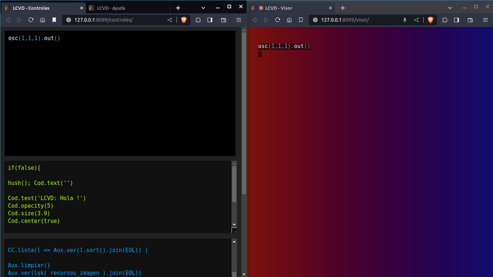
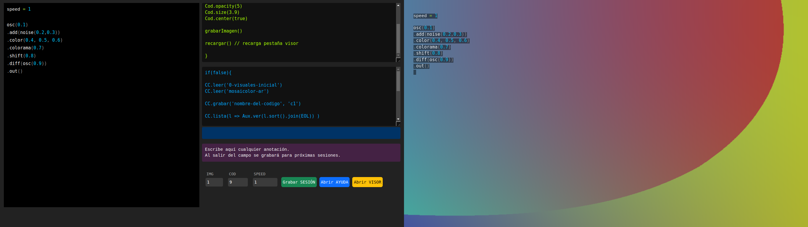

# LCVD - Live Coding Visor Disociado

Herramienta para editar y ejecutar código javascript en una pestaña disociada de los controles.

Está pensado para usarse de forma offline, por eso incorpora las librerías de terceros.

Las tecnologías integradas son: hydra, p5js, bootstrap, prism, prettier.

## Lógica de funcionamiento

El concepto es trabajar con dos pestañas que se comunican entre sí. En una de ellas está el código y en la otra las visuales.

Además incorpora algunas funcionalidades para grabar y leer los códigos con que se está experimentando, y administrar algunos recursos extras como: videos, imagenes y audios.

Para ello requiere de un server local que necesita Python3. Y debe ser activado con el script `activar.py`.

## Instalación
1. Clonar el repositorio. Por ejemplo: `git clone https://github.com/caalma/lcvd`.
2. Instalar Python 3
3. Instalar los requerimientos: `pip3 install -r requirements.txt
`
